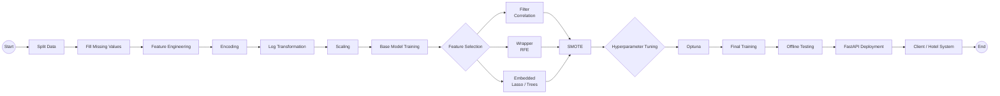

# 🚗 🏨 Hotel Booking Cancellation Prediction

# 🧾 Project Overview
So‘nggi yillarda hotel booking tizimlari juda qulay bo‘lib ketdi. 
Lekin bu qulaylik bilan birga mehmonxonalar uchun bitta jiddiy muammo paydo bo‘ldi —
<b style="color:#ffffff;">booking’larning bekor qilinishi</b>.

- **Task Type:** Binary Classification  
- **Target:** `is_canceled` 

---

## 📊 Dataset

- **Records:** ~119,000+  
- **Features:** 30+  
- **Target:** `is_canceled`

<a href="notebooks/roadmap.ipynb" target="_blank" style="text-decoration: none;">
    <button style="
        background-color: #81c7b4ff;
        color: white; 
        padding: 12px 24px; 
        font-size: 16px; 
        border: none; 
        border-radius: 8px;
        cursor: pointer;
        transition: background-color 0.3s;
    " onmouseover="this.style.backgroundColor='#45a049'" onmouseout="this.style.backgroundColor='#4CAF50'">
        Yanada chuqurroq ko'rmoqchi bo'lsangiz shu yerga o'ting
    </button>
</a>

