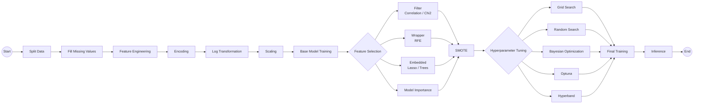

Project: client hotelni bookingini cancel qiladimi yoki qilmaydimi
Nima uchun kerak: hotel clientni oldindan cancel qilishini aniqlash uchun
Yani model "bu client katta chance bilan cancel qiladi" deb aytishi mumkin

